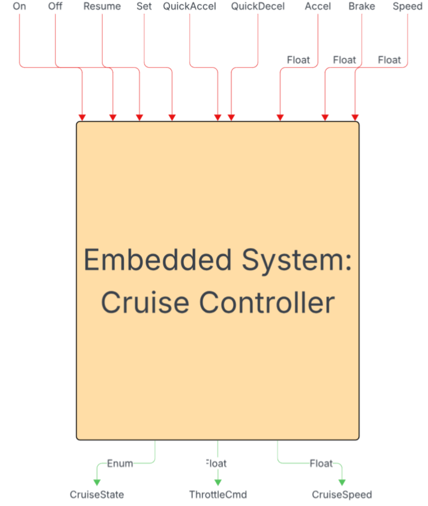
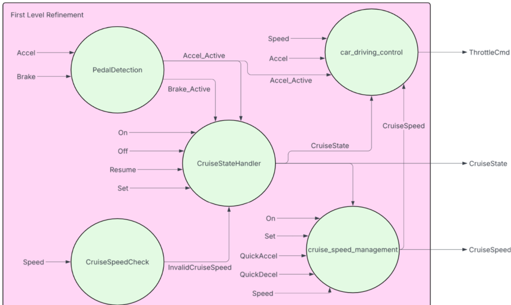
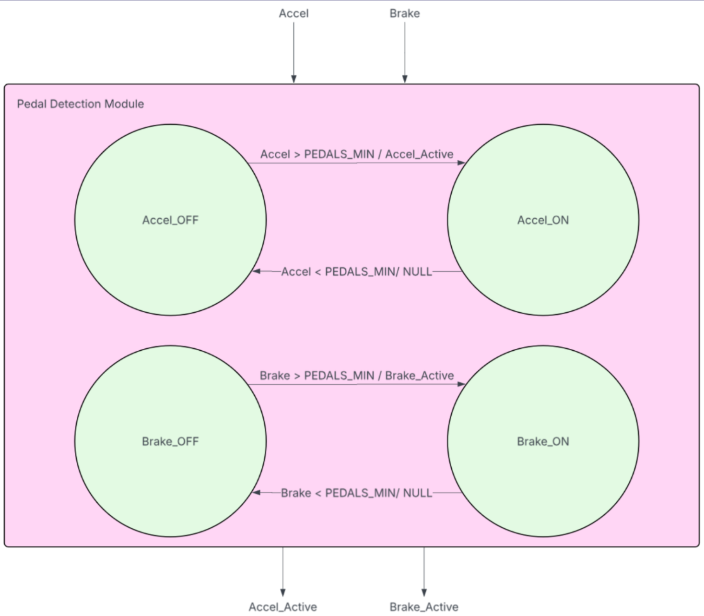
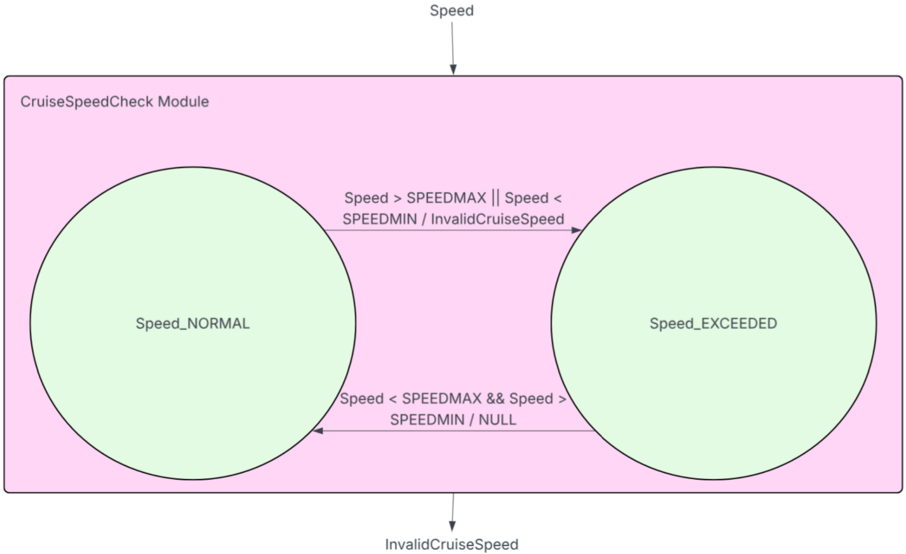
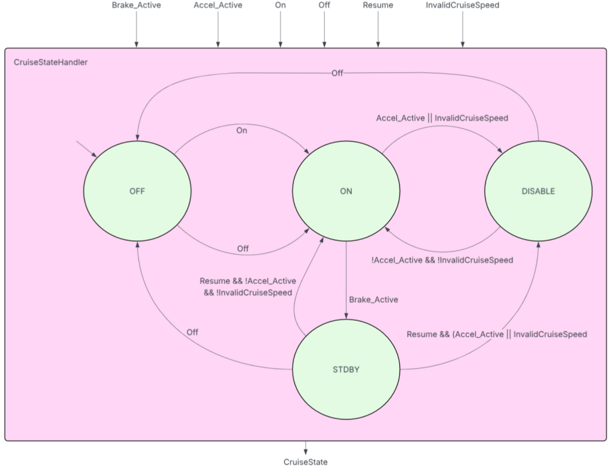
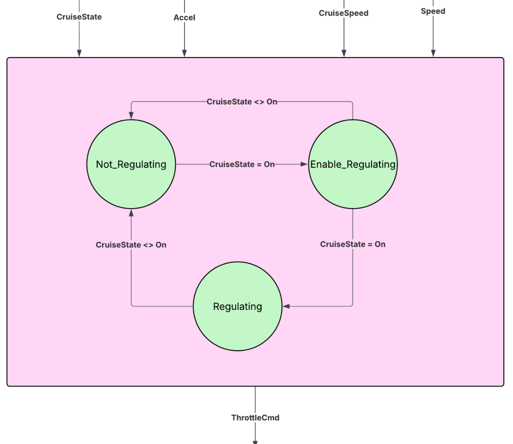
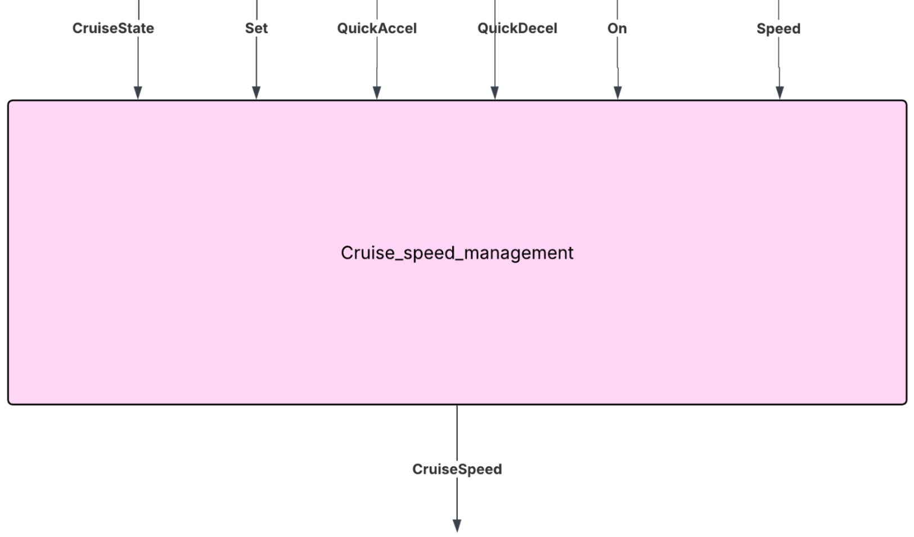

# COMPSYS 723 Assignment 2 - Simplied Cruise Controller in Esterel
University of Auckland - Semester 1 2026
Group 1: Liam Hall and Inesh Bhanuka

## Overview
This project implements a simplified cruise control system using the Esterel V6 synchronous programming language. The assignment demonstrates the development of a model-based embedded system.

## Objectives
The goal of this assignment is to get hands-on experience in the design of
embedded software using a model-based approach. Based on a set of requirements, we aim to develop a functional specification for a cruise control system. This functional specification will then be implemented using the synchronous programming
language Esterel. The result will be an executable reactive program that fulfils the given
requirements for the cruise control system.

### Learning Objectives

* Development of functional specifications to final implementation of an embedded
system.
* Use of hierarchy and concurrency for refining complex embedded systems.
* Experience in implementing high-level functional models of embedded systems using
the Esterel programming language.

## File Structure
The main project files consist of the following:

* cruise_control.h
    * This file contains the function definitions for the C functions required for PI control.
* cruise_control_data.c
    * This file contains the C functions used for PI control
* cruise_control.strl
    * This file contains the Esterel code for the Cruise controller system. The file can be decomposed into the following submodules:
        * Pedal Detection
        * CruiseSpeedCheck
        * CruiseStateHandler
        * car_driving_control
        * car_speed_management
* Makefile
    * The make file necessary to obtain the simulation .xes file needed for testing.
* ctype.c
    * Assisting C file for making the simulation file using make
* ctype.o
    * Assisting file for making the simulation file using make
* cruise_control.xes
    * This file is the esterel generated file for running a simulation, it uses the generated files created when running the make command.
* vectors.in
    * This file contains a set of test cases used in the verification of the system.
* vectors.out
    * This file contains the expected output when the vectors.in file is used for testing, which can be used to validate the design.

## System Inputs
- On 
  - Pure Signal: Enables cruise control
- QuickAccel 
  - Pure Signal: Increases cruise speed
- Off 
  - Pure Signal: Disables cruise control
- QuickDecel 
  - Pure Signal: Decreases cruise speed
- Resume 
  - Pure Signal: Re-enables cruise control after braking
- Accel 
  - Valued Float Signal: Accelerator pedal sensor
- Set 
  - Pure Signal: Sets the current speed as the cruise speed
- Brake 
  - Valued Float Signal: Brake pedal sensor
- Speed 
  - Valued Float Signal: Speed sensor of the vehicle

## System Outputs
- CruiseState 
  - Enumeration (Implemented as Integer): The state of the cruise controller (OFF (1), ON (2), STDBY (3), DISABLE (4)) 
- CruiseSpeed 
  - Valued Float Signal: Cruise speed value 
- ThrottleCmd - Valued Float Signal: Throttle command

## System Parameters
* SpeedMin: 30.0 km/h
* SpeedMax: 150.0 km/h
* SpeedInc: 2.5 km/h
* Kp: 8.113
* Ki: 0.5
* ThrottleSatMax: 45.0%
* PedalsMin: 3.0%
## System Functionality

### Context Diagram
Designed the context diagram, which helped visualize the inputs and outputs of the cruise controller, as shown in Figure 1. The system receives both sensor data inputs and control signals, represented in Esterel as valued float signals and pure signals, respectively. The system provides the system state as an enumeration, as well as two-valued float signals for the cruise speed and throttle command.

  <em>Figure 1: Context diagram.</em>

### First Level Refinement Diagram
The first level refinement diagram shown in Figure 2. shows how the cruise controller design was divided into five submodules: PedalDetection, CruiseSpeedCheck, CruiseStateHandler, cruise_speed_management, and car_driving_control. These submodules are all executed in parallel, within one parent module. 

   
  <em>Figure 2: First-Level Refinement diagram.</em>

## Finite State Machines
### Pedal Detection
The Pedal Detection module is a helper module, described as an FSM in @pedal_detection, detects when the accelerator or brake pedals have been pressed. 

  
  <em>Figure 2: Pedal Detection Diagram.</em>

### Cruise Speed Check
The CruiseSpeedCheck module is another helper module that determines whether the current speed of the car is outside the allowed limits for cruise speed. The FSM for this module is described in Figure 3.

  
  <em>Figure 3: Cruise Speed Check FSM.</em>

### Cruise State Handler
The CruiseStateHandler module defines what operating state the cruise control system is in. It implements a deterministic finite state machine (FSM) that manages the operational mode of the vehicle based on driver commands (On, Off, Resume) and safety flags (Accel_Active, Brake_Active and InvalidCruiseSpeed) generated by the helper modules. The FSM for the CruiseStateHandler is described in Figure 4. 

  
  <em>Figure 4: Cruise State Handler FSM.</em>

The module enumerates four distinct operational modes, mapped to an integer output signal CruiseState:
- OFF_State: System is completely inactive.
- ON_State: System actively regulates vehicle speed.
- STDBY_State: System is temporarily paused due to brake engagement.
- DISABLE_State: System control is overridden due to safe limit violations or accelerator use.

### Car Driving Control
The car_driving_control module is in charge of generating the ThrottleCmd output for the car, this output then used by the car to determine how much to accelerate or decelerate at each time step. The FSM is described in Figure 5.

  
  <em>Figure 5: Car Driving Control FSM.</em>

### Cruise Speed Management
The Cruise_speed_management module operates as a single-state deterministic system, eliminating the need for a complex finite state machine. The module executes sequentially on every system tick. It handles QuickAccel, QuickDeccel and Set inputs for the cruise controller as these inputs are directly involved in the cruise speed output.

  
  <em>Figure 6: Cruise Speed Management FSM.</em>

## How to Run Code

This project requires the Esterel V6 compiler and linux

To compile and run:

make cruise_control.xes
./cruise_control.xes